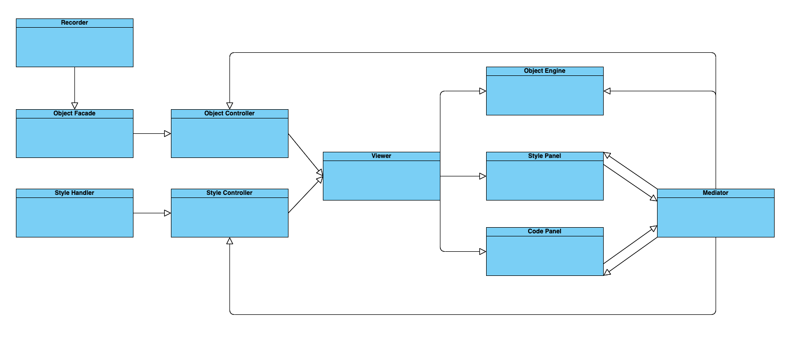

# Программа 3DViewer

## Содержание

1. [Глава I - Архитектура проекта](#глава-i) \
    1.1. [Введение](#введение)
2. [Глава II - Информация](#глава-ii) \
    2.1. [Паттерны проектирования](#паттерны-проектирования)
3. [Глава III - Особенности программы](#глава-iii) \
    3.1. [Часть 1 - 3D_Viewer](#часть-1-3d_viewer) \
    3.2. [Часть 2 - Настройки](#часть-2-настройки) \
    3.3. [Часть 3 - Запись](#часть-3-запись) 

## Глава I - Архитектура проекта

## Введение

Программа 3DViewer представляет собой приложение на языке C++, позволяющее визуализировать 3D-модели в режиме каркаса. Реализована с использованием принципов объектно-ориентированного программирования, она обеспечивает эффективный и удобный просмотр 3D-моделей.

## Глава II - Информация

### Паттерны проектирования

Для решения типовых задач разработки приложений в данном проекте применяются устоявшиеся паттерны проектирования. Паттерны проектирования представляют собой стандартные решения для повторяющихся проблем и подразделяются на три категории: порождающие, структурные и поведенческие.

Ранее в проекте Smart_Calculator_CPP вы уже сталкивались с паттерном Model-View-Controller (MVC), широко используемым при организации кода в приложениях с графическим пользовательским интерфейсом (GUI). Паттерн MVC разделяет пользовательский интерфейс, бизнес-логику и представление данных на отдельные уровни.

Домен интерфейса отвечает за отображение пользовательского интерфейса и передачу команд в домен бизнес-логики. Данные, загруженные из файлов, не должны храниться в домене интерфейса.

Домен бизнес-логики отвечает за основные функции системы, включая обработку данных и отображение.

## Глава III - Особенности программы

### Часть 1 - 3D_Viewer

Часть 3D_Viewer программы предназначена для визуализации 3D-моделей в режиме каркаса в трехмерном пространстве. Ниже приведены основные требования к этой части:

- Программа должна быть разработана на языке C++ с использованием стандарта C++17.
- Код следует размещать в папке `src`.
- При написании кода необходимо придерживаться стандартов оформления Google Style.
- Система сборки программы должна использовать Makefile с стандартными целями GNU: all, install, uninstall, clean, dvi, dist и tests. Возможность установки в любой произвольный каталог.
- Реализовать программу, следуя принципам объектно-ориентированного программирования и избегая структурного подхода.
- Обеспечить полное покрытие модулей, связанных с загрузкой моделей и аффинными преобразованиями, модульными тестами.
- Отображать только одну модель на экране одновременно.
- Реализовать следующие функции:
    - Загрузка каркасных моделей из файлов в формате OBJ (поддержка только списков вершин и граней).
    - Перемещение модели на заданное расстояние вдоль осей X, Y и Z.
    - Поворот модели на заданный угол вокруг осей X, Y и Z.
    - Масштабирование модели до заданного значения.
- Реализовать графический пользовательский интерфейс с использованием любой подходящей GUI-библиотеки для C++:
    * Для Linux: GTK+, CEF, Qt, JUCE
    * Для Mac: GTK+, CEF, Qt, JUCE, SFML, Nanogui, Nngui
- Графический интерфейс должен содержать:
    - Кнопку для выбора файла с моделью и поле для отображения его названия.
    - Зону визуализации каркасной модели.
    - Кнопки и поля ввода для перемещения модели.
    - Кнопки и поля ввода для поворота модели.
    - Кнопки и поля ввода для масштабирования модели.
    - Информацию о загруженной модели, включая название файла, количество вершин и ребер.
- Гарантировать, что программа может обрабатывать и позволяет просматривать модели с разной степенью детализации, содержащими от 100 до 1 000 000 вершин, без зависания или неотзывчивости интерфейса (зависание определяется как отсутствие активности интерфейса более 0,5 секунды).
- Реализовать программу с использованием паттерна Model-View-Controller (MVC), обеспечив:
    - Отсутствие бизнес-логики в коде представления.
    - Отсутствие кода интерфейса в контроллере и модели.
    - Тонкие контроллеры.
- Использовать как минимум три различных паттерна проектирования (например, фасад, стратегия и команда).
- Организовать классы внутри пространства имен `s21`.

### Часть 2 - Настройки

Часть Настройки программы позволяет пользователям настраивать параметры визуализации. Требования к этой части следующие:

- Программа должна позволять пользователям выбирать тип проекции (параллельная или центральная).
- Пользователям следует быть в состоянии настраивать тип (сплошная или пунктирная), цвет и толщину ребер, а также способ отображения (отсутствие, круг, квадрат), цвет и размер вершин.
- Программа должна предоставлять возможность выбора цвета фона.
- Настройки должны сохраняться и сохраняться между перезапусками программы.

### Часть 3 - Запись

Часть Запись программы позволяет пользователям сохранять в файлы изображения, полученные в результате визуализации. Сохранение возможно в форматах BMP и JPEG.
